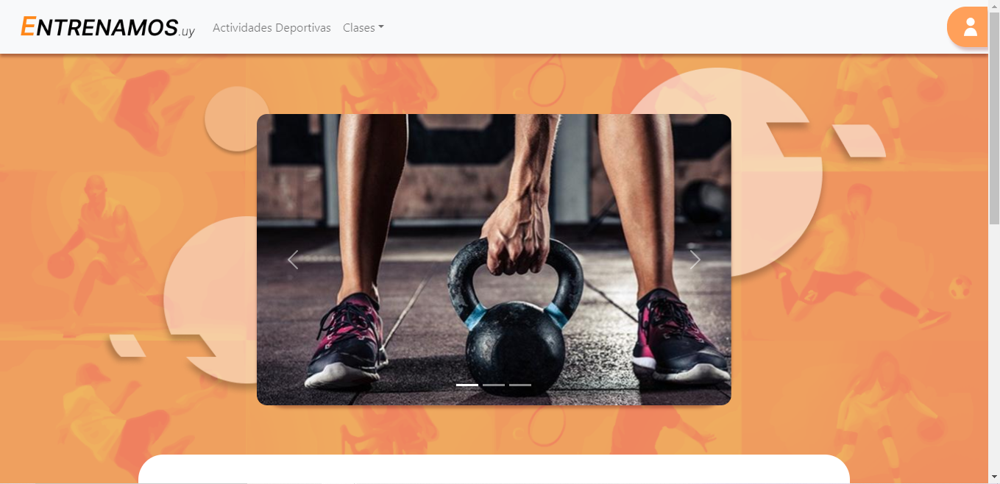
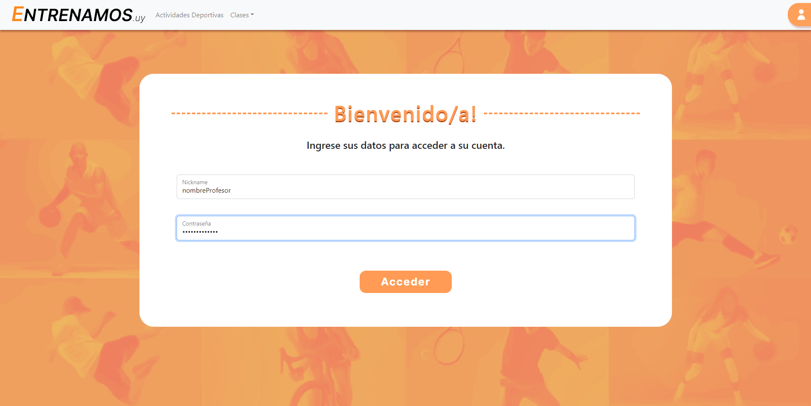
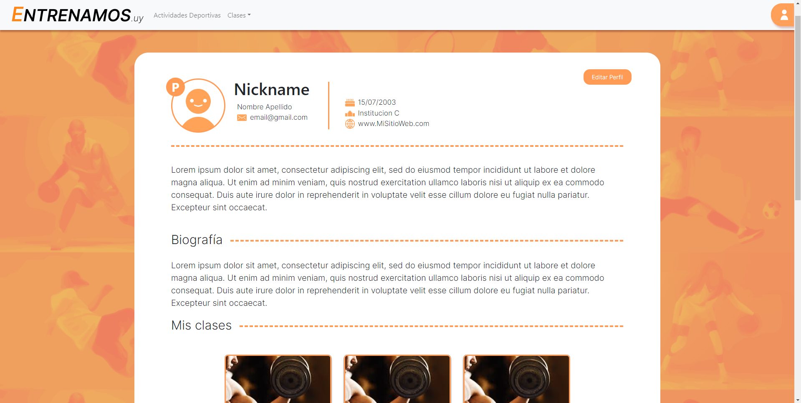
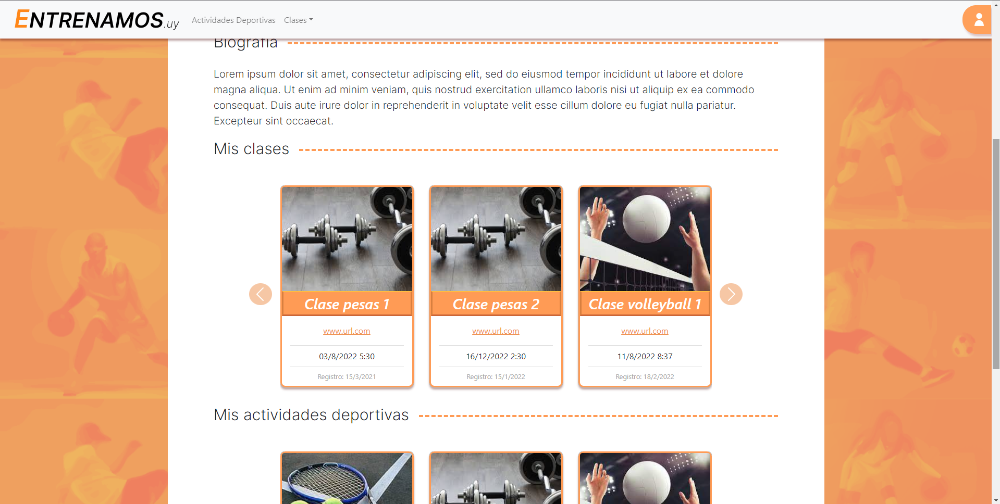
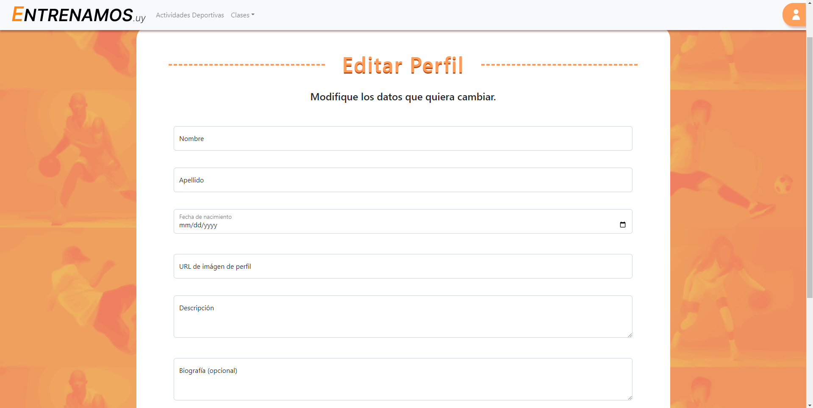
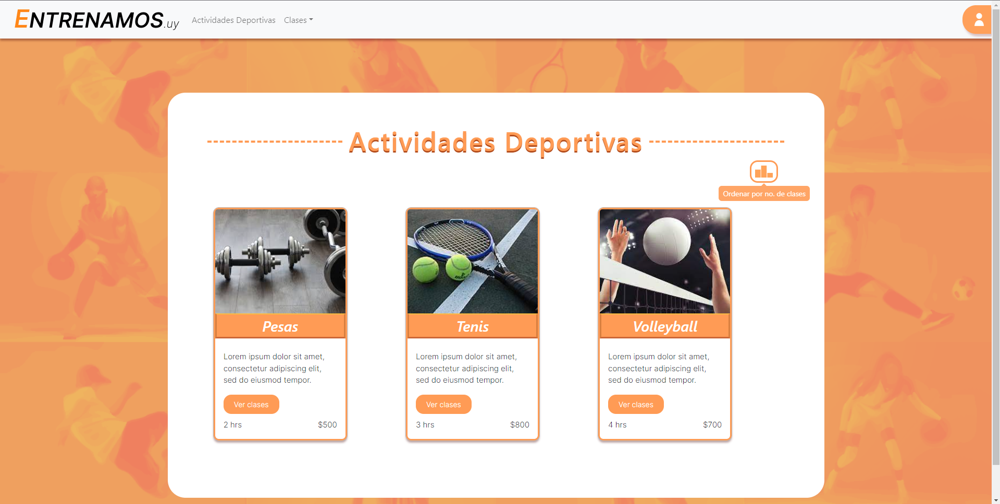
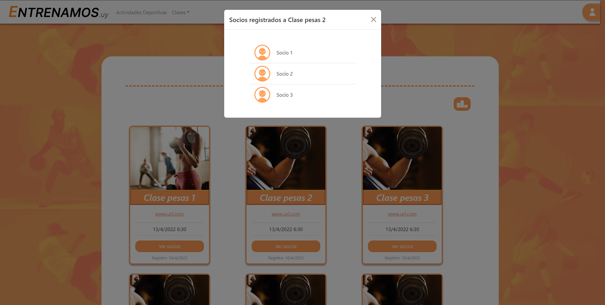
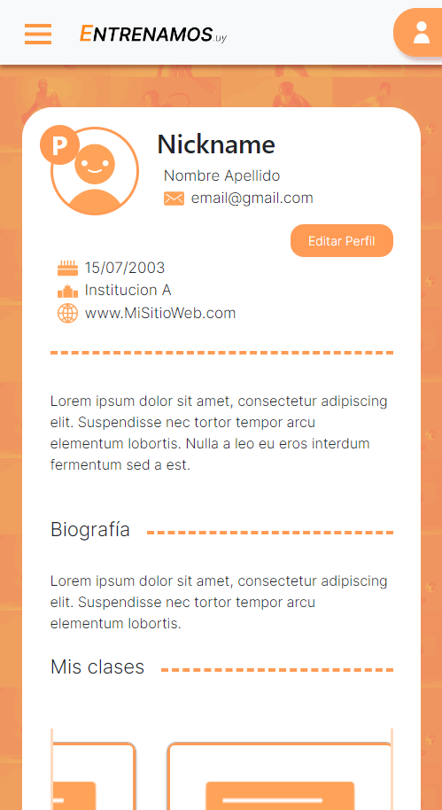
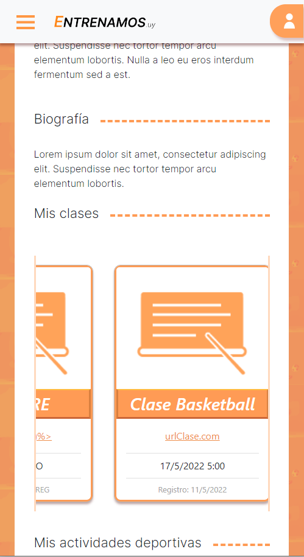

# Lab-PAp-2022
Proyecto en grupo para Programación de Aplicaciones de Tecnólogo en informática. El objetivo de la propuesta era desarrollar una aplicación web dinámica para coordinar clases de entrenamiento físico y deporte. Se utiliza Java para el backend y HTML, CSS, y Bootstrap para el frontend.

